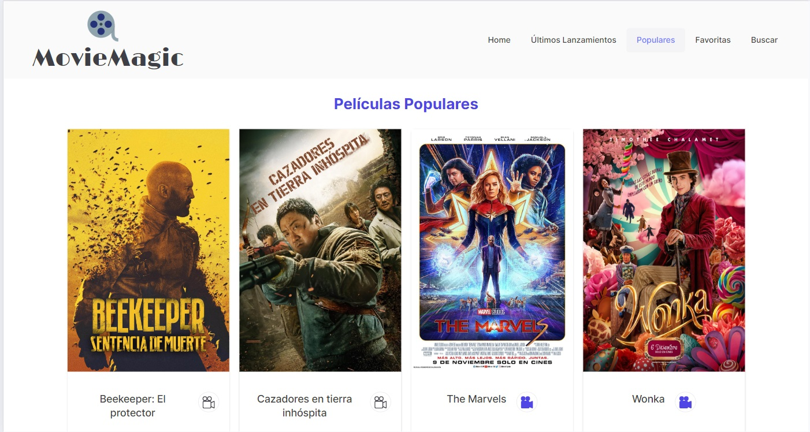
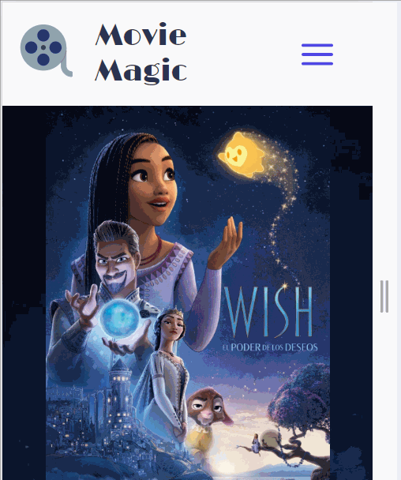

# MOVIE MAGIC APP 📝- ADA ITW

_Deploy link hosted on VERCEL_ >> https://movie-magic-app.vercel.app/

MOVIE MAGIC APP allows you to scroll through several filtered lists of movies from The Movie Database API (TMDB - https://www.themoviedb.org/), such as: Latest Releases, Populars and Top Rated.
This site also lets you search movies by an input form and offers any matching titles.

Whenever you like to get more info about a given movie a simple click on the lists or carrousel from the Home section or the movie cards from Latest Releases / Populars / Search sections redirects you to the movie Detail where you can find its Trailer if available.

As an extra feature you may create your own personal list from your favorite films through a simple click on the CAMERA ICON on either the cards or detail bookmarking them for later revision on the Favorites Section.

## 👥 Developed by:

- ♥ **Sharime Cahuas** (https://github.com/catasha27)  
  (https://www.linkedin.com/in/sharime-cahuas-tamayo-537951159/)

## 💫 The technologies and frameworks used were:

HTML / CSS / GIT / GITHUB

- → React (https://react.dev/)
- → React Router Dom (https://reactrouter.com/en/main)
- → PrimeReact (https://primereact.org/)
- → PrimeReact Icons (https://primereact.org/icons/)
- → React Icons (https://react-icons.github.io/react-icons/)
- → Tailwind (https://tailwindcss.com/)

The project was developed as part of ADA ITW's Front End Developer course last module so we can reinforce the basics of React and practice: Routing / Context / useEffect / Custom Hooks etc.

## 📸 Screenshots to show the APP responsiveness and functionalities

### _Desktop_ - Initial window

Movie Detail

Trailer modal window

Latest release movie cards section

Popular movie cards section

Favorite movie cards section

Search input section and loader

Search results movie cards sections

### _Tablet_ - Views

### _Mobile_ - Views

### _Features_ - Screenshots

Pagination

Header logo and name detail transformation device comparison

### _Features_ - Videos

Burger Menu functionality and Loader

Camera icon toggle functionality

Trailer modal window functionality

### Footer Link being activated

### 🤝🏻 THANKS FOR THE PACIENCE AND DEDICATION OF OUR TEACHERS:

**ANGEL GUILLERMO MONTAÑA** AND **SOFIA FERRER**
DURING THE COURSE OF THE 6TH AND LAST MODULE

### THANKS FOR YOUR VISIT
